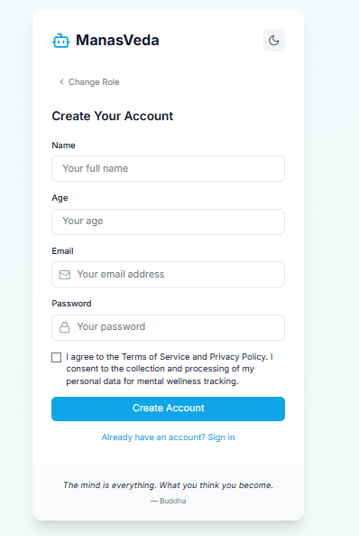

# ManasVeda: Integrated Mental Health & Wellness Platform

ManasVeda is a revolutionary platform that fuses ancient Ayurvedic and Yogic wisdom with modern AI/ML-driven mental health practices. Our solution delivers personalized wellness guidance for students, professionals, educators, and organizations in high-pressure environments.

---

## Live Demo  
🚀 **Live Demo:** [Check out the UI here] https://fancy-naiad-24698d.netlify.app

⚠️ **Note:** This is a very minimal and basic version of the app, primarily for UI testing. More features and improvements  are coming soon!

## Problem Statement

Escalating stress, anxiety, and burnout plague high-pressure environments—such as coaching institutes, schools, and corporate workplaces—and significantly disrupt daily life. Existing solutions are impersonal and disconnected from cultural roots, while scalability remains a major challenge in monitoring large groups. Without an integrated wellness approach that fuses Ayurveda, Yoga, and modern mental health practices, individuals struggle to achieve balanced well-being.

---

## Technology Stack

**Frontend:**  
- **React.js** – For an interactive, responsive UI/UX.

**Backend:**  
- **Django (Python)** – Secure, scalable backend framework.

**Database:**  
- **MySQL & PostgreSQL** – Robust, structured data management.

**AI Integration & NLP:**  
- **Gemini API via Stack.ai** – AI-powered chatbot and NLP for personalized interactions.  
- **Custom ML Models** – For dosha-based assessments, stress analysis, and Moodify (music therapy based on emotion and weather).

**WhatsApp Integration:**  
- **Meta AI Studio & Twilio API** – Automated WhatsApp chatbot for real-time support and daily insights.

**Cloud Services & Deployment:**  
- **AWS / Google Cloud** – For scalable cloud hosting and AI/ML model deployment.

**Security:**  
- **AES-256 Encryption, OAuth 2.0 & JWT Authentication** – Ensuring enterprise-grade security and privacy.

---

## Architecture Overview

- **Scalable, Role-Based Monitoring:**  
  Designed for large organizations with role-specific access controls.
  
- **End-to-End Data Protection:**  
  Robust security measures for comprehensive data protection.
  
- **Seamless Integration:**  
  Connects the ManasVeda Web App with AI/ML services and external platforms (e.g., WhatsApp) for a unified user experience.

---

## Getting Started
Clone the repository:

git clone https://github.com/yourrepo/manasveda.git

Install dependencies:

Frontend: npm install
Backend: pip install -r requirements.txt

Run the application:
Frontend: npm start
Backend: python manage.py runserver

Access the platform:
Open http://localhost:3000 in your browser.

